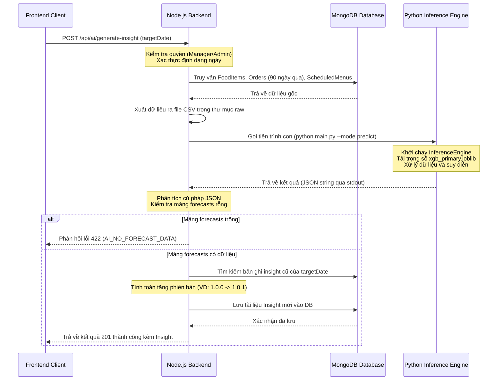

# Báo cáo Kỹ thuật: Module AI Dự đoán nhu cầu tiêu thụ món ăn (StallBox)

## 1. Tổng quan (Overview)
Trong khuôn khổ dự án hệ thống quản lý bán hàng quầy canteen StallBox, phân hệ Trí tuệ Nhân tạo (AI Module) được xây dựng nhằm giải quyết bài toán dự đoán nhu cầu tiêu thụ món ăn (Food Demand Forecasting). 

**Mục tiêu:** Dự đoán chính xác số lượng mỗi món ăn cần chuẩn bị cho các ngày trong tương lai dựa trên dữ liệu lịch sử bán hàng và lịch biểu (Scheduled Menu). Qua đó, hệ thống giúp người quản lý giảm tình trạng dư thừa gây lãng phí thực phẩm hoặc thiếu hụt làm giảm doanh thu, đồng thời hỗ trợ ra quyết định điều chỉnh số lượng chế biến thực tế trên Daily Menu (Thực đơn hàng ngày).

---

## 2. Phương pháp tiếp cận và Thuật toán
Bài toán được định nghĩa dưới dạng Học có giám sát (Supervised Learning) với dạng dữ liệu bảng (Tabular Data).

Dựa trên đặc thù dữ liệu bán hàng có nhiều biến động phi tuyến tính (non-linear relationships), đồ án lựa chọn 2 mô hình học máy dạng cây quyết định:
1. **Random Forest Regression (Mô hình Baseline):** Một thuật toán ensemble mạnh mẽ, ít bị quá khớp (overfitting) và hoạt động ổn định với các tập dữ liệu nhỏ hoặc nhiễu.
2. **XGBoost Regression (Mô hình Chính):** Một thuật toán Gradient Boosting tiên tiến, có khả năng tối ưu hóa hàm mất mát cực tốt, tốc độ huấn luyện nhanh và mang lại độ chính xác cao đối với bài toán chuỗi thời gian dạng bảng.

### Cơ chế Phòng ngừa Crash khi gặp Dữ liệu Mới (Unseen Labels Handling):
Trong môi trường vận hành thực tế, khi canteen thêm món ăn hoặc danh mục mới chưa từng xuất hiện trong tập huấn luyện (training set), bộ mã hóa nhãn (`LabelEncoder` của scikit-learn) sẽ báo lỗi `ValueError`. Để ngăn chặn sập hệ thống (crash), module suy diễn (`predict.py`) được thiết kế cơ chế cách ly: các nhãn chưa được huấn luyện sẽ tự động gán lượng nhu cầu dự báo bằng `0` và số lượng khuyến nghị bằng `0` mà không cần chạy qua mô hình XGBoost, đảm bảo hệ thống luôn vận hành ổn định.

---

## 3. Kiến trúc Tiền xử lý dữ liệu (Data Preprocessing Pipeline)
Quá trình tiền xử lý đóng vai trò quyết định tới chất lượng của mô hình. Pipeline được xây dựng với các bước kiểm soát nghiêm ngặt nhằm tránh rò rỉ dữ liệu (Data Leakage):

1. **Tổng hợp dữ liệu (Aggregation):** Dữ liệu giao dịch (transactions) được nhóm theo `(date, item_id)` để tính tổng số lượng bán ra (`quantity_sold`) theo từng ngày.
2. **Lấp đầy khoảng trống (Zero-Filling):** Hệ thống tự động tạo ra một ma trận thời gian hoàn chỉnh cho tất cả các món ăn. Những ngày món ăn không phát sinh giao dịch sẽ được lấp đầy bằng giá trị `0`. Đây là bước thiết yếu để mô hình học được các khoảng thời gian "không có nhu cầu".
3. **Phân lập Dữ liệu theo Nhóm (Per-group Transformation):** Khi trích xuất các đặc trưng thời gian (lags, rolling averages), hệ thống bắt buộc áp dụng phép toán dịch chuyển `shift(1)` **bên trong từng nhóm món ăn (group by item_id)**. Kỹ thuật này chặn đứng rủi ro rò rỉ chéo (cross-item leakage) — nơi doanh số của món ăn A bị lọt vào dữ liệu lịch sử của món ăn B.
4. **Loại bỏ dữ liệu thiếu (Strict Drop-NA Policy):** Trong giai đoạn khởi tạo các đặc trưng trượt (rolling/lag), những ngày đầu tiên không đủ lịch sử dữ liệu (VD: 7 ngày đầu) sẽ bị loại bỏ hoàn toàn thay vì điền số 0 hay điền lùi.
5. **Cơ chế Chống Rò rỉ Mục tiêu (Target Leakage Prevention):** Ở chế độ dự đoán (Inference Mode), biến mục tiêu `quantity_sold` được cố ý gỡ bỏ (drop) hoàn toàn khỏi ma trận đặc trưng trước khi đưa vào mô hình. Điều này ngăn chặn việc hệ thống sử dụng lượng bán 0 (zero-filled của ngày dự đoán) như một manh mối sai lệch để dự báo.
6. **Xử lý tập dữ liệu rỗng (Empty Dataset Safety):** Khi cơ sở dữ liệu chưa phát sinh đơn hàng, hệ thống vẫn xuất ra file CSV chỉ chứa dòng tiêu đề (headers) để làm sạch tệp tin cũ.

---

## 4. Trích xuất Đặc trưng (Feature Engineering)
Dữ liệu đầu vào được làm giàu bằng cách trích xuất 3 nhóm đặc trưng (features) quan trọng:

*   **Nhóm Đặc trưng Thời gian (Temporal Features):** `day_of_week`, `month`, `is_weekend`. Nhu cầu tiêu thụ tại canteen bị ảnh hưởng nặng nề bởi tính chu kỳ của các ngày trong tuần (VD: thứ 7, chủ nhật sinh viên nghỉ học dẫn đến nhu cầu giảm).
*   **Nhóm Đặc trưng Lịch biểu (Scheduled Menu Features):** Đây là yếu tố khác biệt của hệ thống StallBox.
    *   `is_scheduled`: Cờ (0/1) xác định món ăn có nằm trong lịch bán của ngày hôm đó hay không. (Tín hiệu quyết định nhất tới nhu cầu).
    *   `scheduled_item_count`: Tổng số món ăn được lên lịch trong cùng một ngày. Tính năng này mô hình hóa mức độ cạnh tranh (variety) giữa các món ăn.
    *   `item_scheduled_freq`: Số ngày trong tuần mà món ăn đó được lên lịch (nhằm phân biệt món ăn thiết yếu bán hàng ngày với các món đặc sản bán theo ngày).
*   **Nhóm Đặc trưng Lịch sử (Historical Time-Series Features):**
    *   **Lags:** Số lượng bán của món ăn đó vào 1 ngày trước, 2 ngày trước, và 7 ngày trước (`quantity_lag_1`, `quantity_lag_2`, `quantity_lag_7`). Khớp với chu kỳ tuần tự của canteen.
    *   **Rolling Statistics:** Trung bình trượt 3 ngày, 7 ngày và độ lệch chuẩn trượt 7 ngày (`quantity_roll_mean_3`, `quantity_roll_mean_7`, `quantity_roll_std_7`). Giúp mô hình bắt được xu hướng tiêu thụ (trend) đang tăng hay giảm của món ăn. Dữ liệu trượt được tính toán nghiêm ngặt dựa trên giá trị bị đẩy lùi (`shift(1)`) để ngăn chặn việc sử dụng dữ liệu tương lai.

---

## 5. Phân chia Dữ liệu và Đánh giá (Model Evaluation)
### 5.1. Time-Series Cross Validation (Kiểm chéo Chuỗi thời gian)
Khác với các bài toán phân lớp thông thường, việc chia tập dữ liệu ngẫu nhiên sẽ phá vỡ cấu trúc thời gian. Trong đồ án này, mô hình áp dụng kỹ thuật **TimeSeriesSplit**:
- Dữ liệu được chia theo thứ tự thời gian, mô phỏng đúng luồng dữ liệu thực tế (dùng quá khứ để đoán tương lai).
- Tích hợp **3-fold cross-validation** giúp đánh giá mô hình qua nhiều cửa sổ thời gian (rolling windows) thay vì chỉ đánh giá trên một điểm cắt duy nhất (single hold-out). Điều này mang lại chỉ số đánh giá khách quan và sát thực tế hơn.
- Trong bước huấn luyện cuối cùng, thuật toán tiến hành phân chia 80% dữ liệu đầu làm tập Train, 20% gần nhất làm tập Test.

### 5.2. Bảo toàn Cấu trúc Đặc trưng (Feature Schema Validation)
Một điểm yếu hệ thống của thư viện XGBoost là dự đoán dựa trên thứ tự cột (column order) chứ không phải tên cột, dẫn tới nguy cơ **Silent Model Degradation** (suy giảm hiệu năng thầm lặng). Để khắc phục:
- Danh sách thứ tự `feature_columns` được tự động trích xuất ngay tại thời điểm huấn luyện và lưu trữ song song với trọng số mô hình vào tập tin `encoders.joblib`.
- Tại thời điểm suy diễn (Inference), ma trận dữ liệu sẽ được xác thực đối chiếu với danh sách đã lưu. Nếu thứ tự cột bị lệch, module sẽ chặn suy diễn và báo lỗi rõ ràng, bảo vệ hệ thống khỏi những kết quả dự báo sai lệch.

### 5.3. Kết quả Đánh giá Mô hình (MVP Phase)
Kết quả kiểm thử trên dữ liệu mẫu giả lập (60 ngày) thu được các chỉ số sau:
- **Random Forest (Baseline):** `MAE = 0.57`, `RMSE = 1.16`, `R² = 0.17`
- **XGBoost (Primary):** `MAE = 0.64`, `RMSE = 1.33`, `R² = -0.09`

**Nhận xét:**
1. Trên tập dữ liệu mẫu nhỏ lẻ với nhiều độ nhiễu được tạo giả lập, thuật toán dạng Bagging như **Random Forest cho hiệu suất ổn định và chống overfitting tốt hơn (R² > 0)**.
2. Thuật toán **XGBoost có dấu hiệu Overfitting (R² < 0)** do đặc thù thuật toán Gradient Boosting cần lượng dữ liệu lớn. Dù vậy, sai số tuyệt đối trung bình **MAE chỉ ở mức ~0.5 đến 0.6**. Tức là trung bình, số lượng dự đoán chỉ lệch khoảng nửa phần ăn so với thực tế, hoàn toàn chấp nhận được ở giai đoạn Proof-of-Concept.
3. Trong môi trường sản xuất thực tế, khi thu thập đủ dữ liệu giao dịch thật trong vài tháng, hiệu suất của cả hai thuật toán (đặc biệt là XGBoost) sẽ tự động cải thiện vượt bậc nhờ khả năng lập bản đồ các hàm phi tuyến tính mạnh mẽ.

---

## 6. Kiến trúc Tích hợp Hệ thống (System Integration Architecture)
Kiến trúc tích hợp giữa máy chủ backend Node.js (Express) và lõi dự báo Python được thiết kế theo mô hình Inter-Process Communication (IPC):

### Cơ chế Quản lý Phiên bản (Version Control):
Mỗi lần người dùng kích hoạt dự đoán cho một ngày cụ thể, nếu bản ghi insight của ngày đó đã tồn tại trong Database, hệ thống backend sẽ tự động tính toán tăng số phiên bản (Ví dụ: `1.0.0` nâng lên thành `1.0.1` nhờ tăng patch version). Các thuộc tính dự đoán cũ sẽ được cập nhật phiên bản mới để nhà quản trị canteen so sánh hiệu quả dự đoán qua từng lần thay đổi lịch trình.

---

## 7. Các Cải tiến Bảo mật và Tối ưu hóa Hiệu năng
Nhằm đáp ứng yêu cầu chất lượng chuyên môn cao, các giải pháp kỹ thuật đã được tối ưu hóa toàn diện:

*   **An toàn tiến trình (Command Injection Prevention):** Loại bỏ hoàn toàn phương thức gọi `exec` thông qua chuỗi lệnh thô. Backend sử dụng phương thức `execFile` của thư viện `child_process` để truyền trực tiếp các đối số dưới dạng danh sách mảng an toàn.
*   **Mã hóa ký tự Unicode trên Windows (Unicode Support):** Khi chạy máy chủ trên môi trường Windows, backend định cấu hình biến môi trường `PYTHONIOENCODING: "utf-8"` để đảm bảo Python in luồng dữ liệu chuẩn hóa UTF-8. Nhờ đó, các ký tự tiếng Việt có dấu đặc thù (như chữ `Đ`) được xử lý mượt mà mà không gặp lỗi `UnicodeEncodeError`.
*   **Xử lý bất đồng bộ không gây nghẽn luồng (Non-blocking I/O):** Thay thế toàn bộ phương thức ghi file đồng bộ `writeFileSync` bằng phương thức bất đồng bộ `fs.promises.writeFile`. Việc này giúp đảm bảo Node.js Event Loop không bị tắc nghẽn khi xuất các tệp CSV dung lượng lớn.
*   **Giới hạn truy vấn Database (Database Optimization):** Để tối ưu hiệu năng và bộ nhớ Ram khi dữ liệu đơn hàng phình to, bộ xuất dữ liệu chỉ lọc các đơn hàng có trạng thái `"Completed"` và được tạo trong vòng **90 ngày gần nhất** thay vì tải toàn bộ cơ sở dữ liệu.
*   **Ràng buộc Nghiệp vụ (Business Integrity):** Nếu kết quả trả về từ AI không có bất kỳ dự đoán nào (mảng forecasts rỗng do không có dữ liệu bán hàng lịch sử cho nhóm món ăn tương ứng), backend sẽ chặn không cho lưu vào DB và trả về mã lỗi **422 Unprocessable Entity** kèm mã lỗi nghiệp vụ `"AI_NO_FORECAST_DATA"`.
*   **Bảo chứng Chất lượng Kiểm thử (Testing Quality):** Triển khai thành công bộ kiểm thử tự động toàn diện thông qua thư viện `Vitest` bao phủ kiểm tra các tầng Service và Route Endpoint bảo mật (đạt tỷ lệ vượt qua 100% với 45/45 trường hợp kiểm thử).

---

## 8. Kiến trúc Lai (Hybrid Architecture) trong Định giá Động (Dynamic Pricing)
Một trong những tính năng nổi bật của phân hệ AI là **Gợi ý Định giá Động (Dynamic Pricing Recommendations)**. Thay vì lạm dụng AI cho mọi tác vụ, hệ thống được thiết kế theo kiến trúc **Hybrid (Lai)** kết hợp giữa **Regression-based Forecasting (Học máy)** và **Rule-based Pricing (Hệ chuyên gia)** nhằm tối ưu hóa hiệu năng và đảm bảo an toàn tài chính cho canteen.

### 8.1. Regression-based Forecasting (Dự báo bằng Học máy)
*   **Thực thi:** Khối lõi AI (Python).
*   **Cơ chế:** Vì lượng cầu dự báo là một biến liên tục (continuous value), bài toán dự báo bản chất là Hồi quy (Regression). Mô hình XGBoost phân tích dữ liệu lịch sử để dự báo ra tổng lượng cầu của cả ngày ($D_{total}$).
*   **Vai trò:** Xử lý các yếu tố bất định và phức tạp mà con người không thể tự tính toán thủ công dựa trên kinh nghiệm.

### 8.2. Rule-based Pricing (Định giá theo Quy tắc)
*   **Thực thi:** Khối Backend (Node.js).
*   **Cơ chế:** Áp dụng hệ luật kinh doanh (If-Then) kết hợp dữ liệu bán hàng thời gian thực. 
*   **Công thức nghiệp vụ:**
    *   **Nhu cầu còn lại (Remaining Demand):** $D_{remain} = \max(0, D_{total} - SoldToday)$
    *   **Tồn dư dự kiến (Excess Inventory):** $Excess = \max(0, RemainingQuantity - D_{remain})$
    *   **Bảo vệ Biên lợi nhuận (Floor Price Check):** $RecommendedPrice = \max(Cost \times 1.05, DiscountedPrice)$
*   **Vai trò:** Xử lý logic nghiệp vụ một cách minh bạch, cho phép quản lý canteen tự do thay đổi luật giảm giá (10%, 20%, 50%) theo các khung giờ (14:00, 16:00, 18:00) thông qua hệ thống Scheduler tự động. Node.js lấy dữ liệu trực tiếp từ Database và tính toán chỉ trong vài mili-giây mà không tốn chi phí giao tiếp IPC với Python.

**Kết luận:** Sự phân tách rõ ràng này giúp hệ thống đạt được sự cân bằng hoàn hảo giữa tính thông minh của AI và sự chặt chẽ của phần mềm quản lý tài chính, ngăn chặn rủi ro mô hình AI tự đưa ra các mức giảm giá vô lý dẫn đến kinh doanh thua lỗ.
