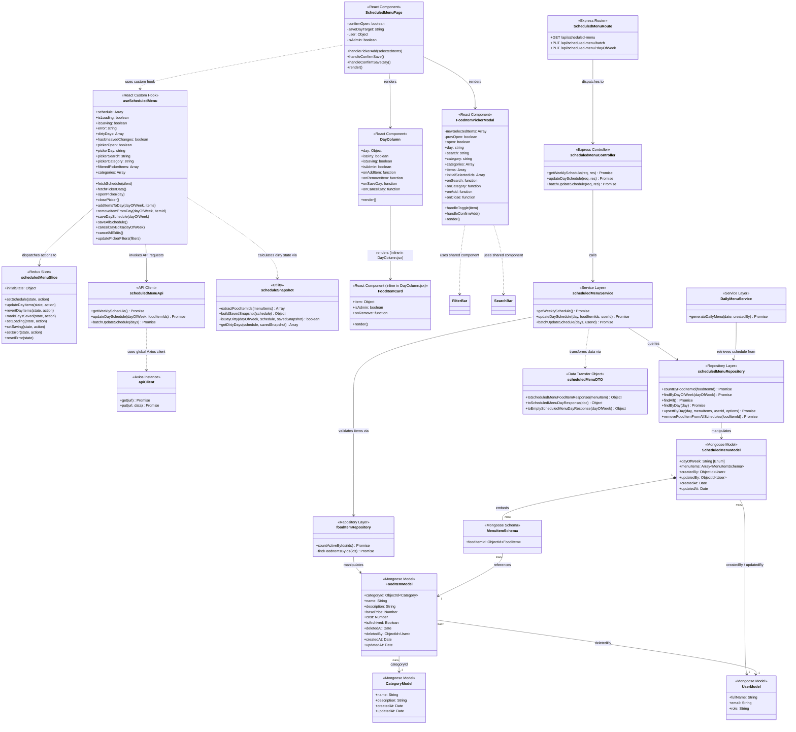

# Class Diagram — Scheduled Menu Management

This document details the class structure and structural relationships within the **Scheduled Menu Management** module for both the Frontend and Backend services. 

The architecture adheres to a clean separation of concerns:
* **Frontend**: React Components, Custom Hooks, Redux Toolkit (state management), and REST API client layers.
* **Backend**: Express Router, Controller, Validation, Service, Repository (data access), DTO (data transfer object), and Mongoose ODM models.

---

## 1. Mermaid Class Diagram

---

## 2. Component Explanations

### 2.1 Backend Layer (Express & Mongoose)
* **`ScheduledMenuModel`**: Maps directly to the MongoDB `scheduled_menus` collection. It ensures data consistency through enum validation on `dayOfWeek` and requires a reference to active food items.
* **`ScheduledMenuRoute`**: Handles HTTP endpoints. Uses validation middlewares (`validateDayParam`, `validateUpdateBody`) and authentication/authorization middlewares (`authenticate`, `authorizeRoles`).
* **`scheduledMenuController`**: Extracts params and request bodies, maps async logic via `asyncHandler`, and delegates to `scheduledMenuService`. It returns formatted responses using `successResponse`.
* **`scheduledMenuService`**: Encapsulates business logic. It checks for duplicate items, validates that requested food items are existing and active in the database (via `foodItemRepository`), and orchestrates updates or reads.
* **`scheduledMenuRepository`**: Contains all database queries for ScheduledMenu. Uses standard Mongoose helper methods like `findOneAndUpdate` with query populate stages.
* **`scheduledMenuDTO`**: Structures MongoDB documents into standardized responses for client consumption. This decouples database internal fields (like database versioning `__v` or password hashes) from clients.

### 2.2 Frontend Layer (React & Redux Toolkit)
* **`ScheduledMenuPage`**: The entry page rendering the weekly schedule board. It delegates state management and asynchronous operations to `useScheduledMenu`.
* **`DayColumn`**: Renders a vertical column representing a specific weekday (e.g. Thứ 2). Contains inline `FoodItemCard` sub-component and triggers action events.
* **`FoodItemPickerModal`**: A multi-select checklist modal to add food items to a specific day. Uses shared `SearchBar` and `FilterBar` from `components/search/`.
* **`useScheduledMenu`**: A React hook containing the core UI controller logic, fetching backend schedules, tracking local modifications, and calling state management actions.
* **`scheduledMenuSlice`**: Stores the global Redux state: the active `schedule` array, `savedSnapshot` (for tracking changes), loading states, and API errors.
* **`scheduleSnapshot`**: Computes differences between current state and saved database snapshot to determine if a day is "dirty" (i.e. contains unsaved modifications).
