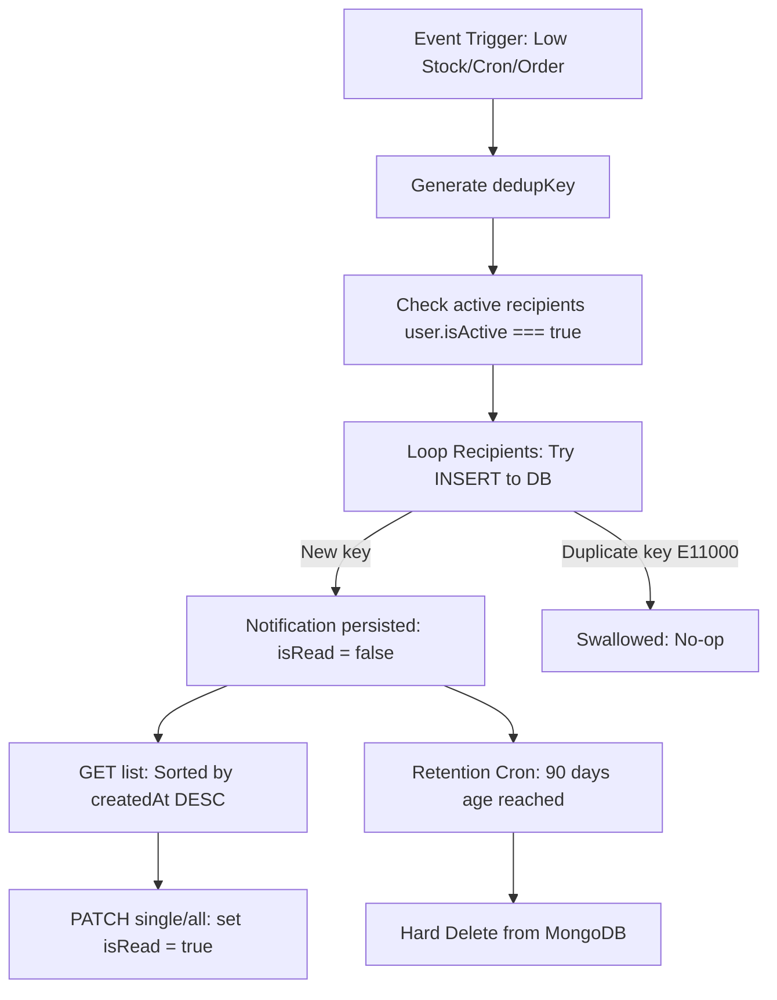
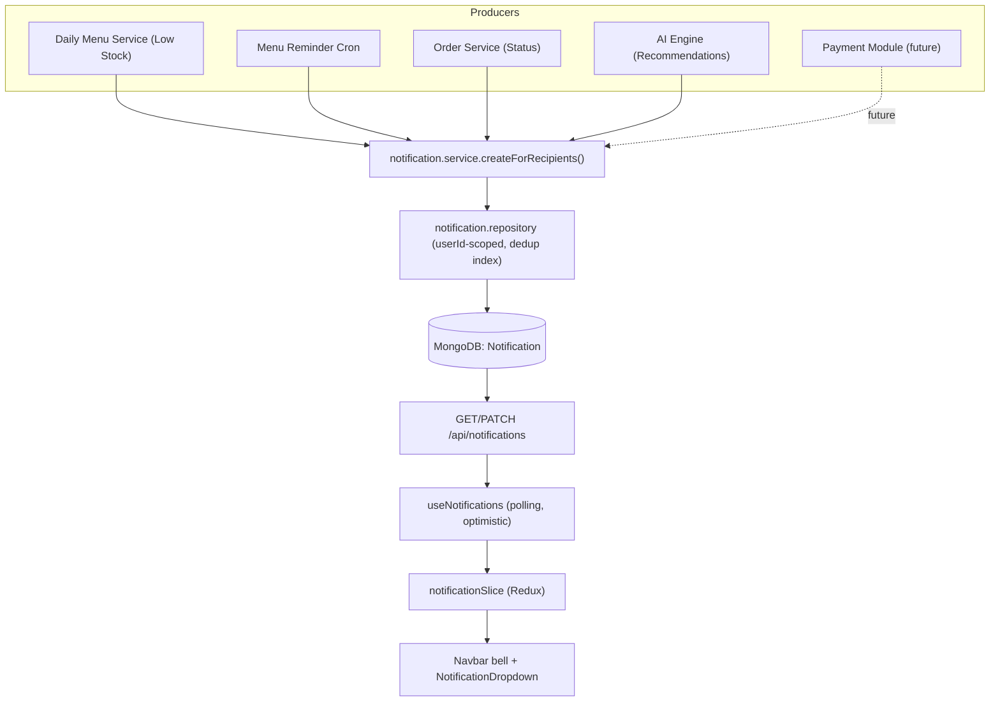

# Software Requirements Specification (SRS) — System Notifications

**Module:** System Notifications  
**Application:** StallBox  
**Version:** 1.1  
**Status:** Verified against codebase (`project-clean/frontend`, `project-be/backend`)  
**Positioning:** Notification Framework — a single, shared infrastructure that any producer module (Daily Menu, Order, Inventory, AI Engine, future Payment) integrates with by calling the Notification Service. No producer module owns its own notification storage or delivery.  

---

## 1. Introduction

### 1.1 Purpose
This document specifies the software requirements for the **System Notifications** module in StallBox. It outlines the notification taxonomy, roles, UI component contracts (specifically for the notification dropdown and Navbar bell), functional requirements, database persistence logic, security and ownership rules, API specifications, and acceptance criteria. It serves as the primary technical blueprint for front-end, back-end, and QA engineers.

### 1.2 Scope
Included in this specification:
1. Persistent database-backed notifications displayed within the navbar notification bell and dropdown.
2. Three supported notification categories handled by the framework: **System Alerts** (Low Stock, Menu reminders), **Order Notifications** (Order Status), and **AI Recommendation Notifications** (produced by the external AI Engine). See Section 5 for the full taxonomy.
3. A **Notification Service integration contract** (Section 14) that lets any producer module create notifications without duplicating persistence, dedup, ownership, or delivery logic.
4. Multi-recipient fan-out logic based on active user status and roles.
5. Client-side polling mechanism to refresh notifications when the application tab is active.
6. Daily automatic retention jobs to purge old notification entries.
7. Ownership-enforced API endpoints for querying and marking notifications as read.
8. A clear **Notification Boundary** (Section 3.3) distinguishing Toast, Dialog/Modal, and Bell notifications.

This specification covers the **notification infrastructure only**. The following producer logic is owned by other modules and is therefore **explicitly out of scope to implement here**, while the infrastructure to receive and render their notifications is fully specified so integration requires no redesign:
- The **AI Engine** itself (forecasting, quantity/pricing/waste optimization, insight generation). The Notification Module only persists and renders `AI_Alert` records when the AI Engine calls the Notification Service.
- The **Order module** state machine that emits status transitions (FR-23–FR-26 consume its events).

Excluded from scope for v1:
- Ephemeral toast notifications (implemented separately as action feedback — see Section 3.3).
- WebSocket-based real-time push, email, SMS, or mobile push notification deliveries.
- Dedicated full-page notification management console.
- Navigation/deep-linking when clicking notifications (v1 only supports marking items as read).
- Pagination control inside the dropdown list (v1 displays the first page up to 50 items).
- Manual deletion or archiving of individual notifications by users.

---

## 2. User Roles and Actors

| Actor | Description | Navbar Notification Bell | Receive Low Stock Alerts | Receive Menu Reminders | Receive Order Status Alerts | Receive AI Recommendations |
| :--- | :--- | :---: | :---: | :---: | :--- | :---: |
| **Admin** | Stall owner or system administrator | Yes | Yes (all items) | Yes | Yes (all orders) | Yes |
| **Manager** | Canteen manager | Yes | Yes (all items) | Yes | Yes (all orders) | Yes |
| **Staff** | Operational staff | Yes | No | No | Yes (only orders where `staffId === user._id`) | No |

AI Recommendation recipients (Admin + Manager) mirror the roles authorized to act on AI output in the codebase: `apply-ai-quantity` and `apply-ai-price` routes are guarded by `authorizeRoles(USER_ROLES.MANAGER, USER_ROLES.ADMIN)` in `daily-menu.route.js`. Staff cannot apply AI recommendations and therefore do not receive them.

### Visibility Rule
- To receive notifications, the target user must be active (`user.isActive === true`). Inactive or locked accounts must not receive notifications.
- All notification list queries (`GET /api/notifications`) and update requests (`PATCH /api/notifications/...`) are scoped to the authenticated user's ID (`req.user._id`). There are no global or cross-user query endpoints.

---

## 3. UI Component Description

### 3.1 Navbar Bell Button (Existing)
- Bell icon button positioned in the Navbar (`notifications` symbol).
- Declares `aria-label="Thông báo"` for accessibility.
- Displays a red badge indicating the number of unread notifications (`unreadCount`).
- The badge is capped at `"9+"` when the unread count exceeds 9.
- Hidden when `unreadCount` is 0.

### 3.2 NotificationDropdown (Existing - Contract Extension)
- Toggled on and off by clicking the Navbar Bell Button.
- **Header**: Shows `"Thông báo"`, unread count badge, and a `"Đánh dấu tất cả đã đọc"` text button.
  - The `"Đánh dấu tất cả đã đọc"` button is only visible when `unreadCount > 0`.
- **List Area**: Displays scrollable list items with `max-h-[360px]`.
- **Empty State**: Renders `notifications_off` icon and text `"Không có thông báo nào"` when list is empty.
- **Contract Extension Props (Optional)**:
  - `isLoading`: Boolean. When `true` and the list is empty, displays `"Đang tải thông báo..."` inside the list container.
  - `isMarkingAll`: Boolean. When `true`, disables the `"Đánh dấu tất cả đã đọc"` button to prevent concurrent duplicate submissions.
- **Item Click Behavior**: Triggers the `onRead(id)` callback. The notification item's unread state changes to read, but does not navigate or trigger page redirection.
- **Type → Icon Mapping (`TYPE_CONFIG`)**: The existing component defines `TYPE_CONFIG` for FE types `order`, `system`, and `payment`, and resolves unknown types via the fallback `TYPE_CONFIG[item.type] ?? TYPE_CONFIG.system`.
  - In v1, `AI_Alert` notifications map to FE type `system`, which renders correctly through the existing fallback with **zero component changes**.
  - **Forward-compatible (optional)**: When the AI Engine merges, an `ai` entry MAY be added to `TYPE_CONFIG` (e.g., icon `psychology`) to give AI notifications a distinct visual. This is a purely additive, backward-compatible enhancement and is not required for v1 correctness. See Section 5 and Section 14.
- **Frontend DTO Mapping Contract**: To align the pre-existing frontend component expectations with backend MongoDB document fields, the `notificationApi` DTO mapper MUST translate:
  - `_id` (backend) → `id` (frontend dropdown item)
  - `content` (backend) → `message` (frontend dropdown item)
  - `createdAt` (backend) → `time` (frontend relative time display string, formatted using `dayjs` in Vietnamese `vi` and `Asia/Ho_Chi_Minh` timezone)
  - `type` (backend: `System_Log` / `Order_Update` / `AI_Alert`) → `type` (frontend: `system` / `order` / `system` fallback, or `payment` if future payment integration is added)

### 3.3 Notification Boundary (Toast vs Dialog vs Bell)

StallBox has three distinct user-feedback channels. They MUST NOT be conflated. The Notification Module owns **only the Bell channel**; the other two are pre-existing UI mechanisms documented here to draw a precise boundary.

| Channel | Storage | Unread state | Polling | Owned by | Purpose |
| :--- | :--- | :--- | :--- | :--- | :--- |
| **Toast** | None (ephemeral) | No | No | `toastSlice` / `useAppToast` (existing) | Immediate UI feedback for the acting user. |
| **Dialog / Modal** | None (transient interaction) | No | No | Individual feature components | An interaction flow that blocks or confirms an action. Not a notification. |
| **Bell Notification** | MongoDB (`Notification`) | Yes (`isRead`) | Yes (60s) | **This module** | Asynchronous business events delivered to one or more users. |

**1. Toast Notification** — Use for transient feedback to the person performing the action:
- Save success, delete success, validation error, API error, network error.
- Checkout success and "bill printed successfully" feedback **for the operator who performed it**.
- Characteristics: not persisted, no unread state, never appears in the bell, no polling. Pure UI feedback.

**2. Dialog / Modal** — Use for interaction flows, not notifications:
- Print bill, confirm delete, payment confirmation.
- Characteristics: part of a synchronous user interaction; produces no `Notification` record.

**3. Bell Notification** — Use for **business events** that other users must learn about asynchronously:
- Low Stock, Menu Reminder, Order Status, AI Recommendation, and future Payment lifecycle events (if the Payment module defines its own lifecycle).
- Characteristics: persisted in MongoDB, polled, unread tracking, mark-read, surfaced via the Navbar bell and dropdown.

**Decision Rule (canonical example):**
- If "Checkout Success" is only feedback to the operator who completed the checkout → **Toast**.
- If a Manager/Admin needs to know an order has been completed → **`Order_Update` Bell Notification** (FR-23).

The same real-world event may legitimately produce both a Toast (for the actor) and a Bell Notification (for other stakeholders); these are independent channels.

### 3.4 MainLayout Integration
- The stubs inside `MainLayout.jsx` are replaced by calling the `useNotifications()` hook.
- No new layout wrapper is created.
- The hook handles mounting, polling lifecycle, visibility change listeners, and dispatches data to Redux.

### 3.5 Polling Lifecycle
- Implemented within `useNotifications.js` to periodically fetch updates:
- Runs an initial fetch when the layout mounts.
- Sets a 60-second polling interval (`setInterval` of 60,000ms) only if `document.visibilityState === 'visible'`.
- Pauses polling (clears interval) when the user switches tabs (`visibilitychange` listener sets state to `hidden`).
- Resumes polling and triggers an immediate silent refetch when the tab becomes visible.
- Cleans up and clears all timers, event listeners, and aborts in-flight requests on component unmount.

---

## 4. Functional Requirements

### 4.1 View, Load, and Refresh Notifications

| FR-ID | Requirement | Trigger | Preconditions | System Response | Related Components | AC |
| :--- | :--- | :--- | :--- | :--- | :--- | :--- |
| **FR-01** | Load notifications on mount | `MainLayout` mounts | User authenticated; JWT exists | Sends `GET /api/notifications?limit=50&page=1`. Maps DTO and populates Redux store with items and unread count. | `useNotifications`, `notificationApi`, `notificationSlice` | **Given** an authenticated Admin, **When** layout mounts, **Then** notifications are requested and red badge updates. |
| **FR-02** | Open dropdown | Click bell icon | FR-01 completes | Toggles dropdown visibility. Displays items in descending order (`createdAt DESC`). | `Navbar`, `NotificationDropdown` | **Given** 3 notifications, **When** bell is clicked, **Then** dropdown opens displaying them newest first. |
| **FR-03** | Polling refresh | Active session interval (60s) | Tab is visible; user logged in | Sends silent query. Replaces items and updates badge count in Redux store. | `useNotifications`, `notificationApi` | **Given** active session for 2 minutes, **When** poll timer ticks, **Then** new notifications appear. |
| **FR-03a** | Start polling on mount | Hook initialization | `MainLayout` mounted | Spawns timer and registers `visibilitychange` listener. | `useNotifications` | **Given** user logged in, **When** hook mounts, **Then** polling is scheduled. |
| **FR-03b** | Stop polling on unmount | Layout unmounts or user logs out | Polling active | Clears interval, removes listeners, aborts in-flight requests. | `useNotifications` | **Given** user logs out, **When** layout unmounts, **Then** polling stops and no memory leaks occur. |
| **FR-04** | Pause polling when backgrounded | Tab switches to hidden | Polling active | Clears interval. Registers visibility handler to resume upon tab focus. | `useNotifications` | **Given** tab backgrounded, **When** 60s passes, **Then** no network requests are sent. |
| **FR-05** | Fallback to cached list on error | API request fails | Prior data was loaded | Retains existing notifications in UI. Displays error toast "Không thể tải thông báo". | `useAppToast`, `notificationSlice` | **Given** cached notifications, **When** query fails, **Then** UI keeps old list and shows error toast. |
| **FR-06** | Format relative time | List renders | `createdAt` ISO string | Formats dates using `dayjs` relative time plugin in Vietnamese (`vi`). Reference timezone: `Asia/Ho_Chi_Minh`. | `notificationApi` (DTO mapper) | **Given** notification created 5m ago, **When** rendered, **Then** time shows "5 phút trước". |
| **FR-07** | Server-side ordering | GET query | None | Database query sorts records by `createdAt DESC`. | `notification.repository` | **Given** 2 notifications (10:00 and 09:00), **When** queried, **Then** 10:00 is first. |
| **FR-08** | Cap dropdown list size | List renders in dropdown | None | Restricts display to a maximum of 50 newest notifications in v1. | `NotificationDropdown` | **Given** 80 notifications in DB, **When** dropdown opens, **Then** only 50 are shown. |

### 4.2 Mark Read Operations

| FR-ID | Requirement | Trigger | Preconditions | System Response | Related Components | AC |
| :--- | :--- | :--- | :--- | :--- | :--- | :--- |
| **FR-09** | Mark single notification read | Click unread item | `isRead === false` | **Optimistic Update**: sets `isRead` to true, decrements `unreadCount`. Dispatches `PATCH /api/notifications/:id/read`. Reverts state and shows toast on failure. | `NotificationDropdown`, `notificationApi`, `notificationSlice` | **Given** unread notification, **When** clicked, **Then** state updates immediately; reverts on API error. |
| **FR-10** | Mark all notifications read | Click "Đánh dấu tất cả đã đọc" | `unreadCount > 0` | **Optimistic Update**: sets all to read, sets badge count to 0. Sends `PATCH /api/notifications/read-all`. Reverts and shows toast on failure. | `NotificationDropdown`, `notificationApi`, `notificationSlice` | **Given** 5 unread items, **When** clicking mark all, **Then** badge clears; reverts if API returns error. |
| **FR-11** | Skip read item requests | Click read item | `isRead === true` | No API dispatch or state updates. | `NotificationDropdown`, `useNotifications` | **Given** read notification, **When** clicked, **Then** no API requests are sent. |
| **FR-12** | Disable mark-all button | mark-all request in progress | `isMarkingAll` prop is true | Disables the header button. Prevents concurrent requests. | `NotificationDropdown` | **Given** slow network, **When** user clicks mark all, **Then** button is disabled until API resolves. |

### 4.3 Low Stock Alerts

| FR-ID | Requirement | Trigger | Preconditions | System Response | Related Components | AC |
| :--- | :--- | :--- | :--- | :--- | :--- | :--- |
| **FR-13** | Detect low stock threshold breach | `remainingQuantity` updated | Daily menu exists; item status is 'Available' | Evaluates rule: `0 < qty <= LOW_STOCK_THRESHOLD`. Breach triggers if true. | `daily-menu.service`, `notification.service` | **Given** threshold is 3 and quantity drops from 4 to 3, **When** updated, **Then** breach detected. |
| **FR-14** | Fan-out low stock alerts | FR-13 true | Target users are active (`isActive === true`) | Computes dedup key. Inserts `System_Log` notifications for all active Admins and Managers. | `notification.service`, `user.repository` | **Given** 1 active Admin and 1 inactive Manager, **When** breach occurs, **Then** notification is generated only for Admin. |
| **FR-15** | Suppress low stock for Staff | FR-13 true | User role is Staff | Excludes Staff users from recipient list. No documents created. | `notification.service` | **Given** a low stock breach, **When** fan-out occurs, **Then** Staff accounts receive no alerts. |
| **FR-16** | Suppress duplicate low stock | FR-13 true | Same `userId` and `metadata.dedupKey` | MongoDB unique index blocks insertion. Service swallows `E11000` silently. | `notification.service`, Mongoose index | **Given** alert sent in current 4-hour window, **When** quantity drops again, **Then** duplicate is ignored. |
| **FR-17** | Ignore threshold recovery | Quantity increased | New qty > threshold | No notification generated. | `daily-menu.service` | **Given** quantity rises from 2 to 10, **When** updated, **Then** no notification is created. |

### 4.4 Daily Menu Reminders

| FR-ID | Requirement | Trigger | Preconditions | System Response | Related Components | AC |
| :--- | :--- | :--- | :--- | :--- | :--- | :--- |
| **FR-18** | Cron reminder Slot A (00:05) | Cron job fires at 00:05 | Today's daily menu exists; `isConfigured === false` | Inserts `System_Log` notification for active Admins and Managers with dedup key `menu_reminder:{menuDate}:00:05`. | `menuReminder.job.js`, `notification.service` | **Given** unpublished menu at 00:05, **When** cron runs, **Then** Admin and Manager receive reminders. |
| **FR-19** | Cron reminder Slot B (06:00) | Cron job fires at 06:00 | Today's menu exists; `isConfigured === false` | Inserts `System_Log` notification with dedup key `menu_reminder:{menuDate}:06:00`. | `menuReminder.job.js`, `notification.service` | **Given** unpublished menu at 06:00, **When** cron runs, **Then** second reminder is generated. |
| **FR-20** | Silent skip when no menu | Cron job fires | Daily menu document does not exist for today | Cron completes silently. No notifications created. | `daily-menu.repository`, `menuReminder.job.js` | **Given** menu document missing, **When** cron runs, **Then** no notifications are dispatched. |
| **FR-21** | Cancel pending reminders | Daily menu published | `isConfigured` is set to true | Future cron jobs skip sending reminders for that day. | `daily-menu.service` | **Given** menu published at 05:00, **When** 06:00 cron runs, **Then** no reminder is generated. |
| **FR-22** | Suppress duplicate reminders | Cron job runs | Dedup key already exists in DB | Insertion skipped. | `notification.service` | **Given** 00:05 reminder already sent, **When** cron is manually re-run, **Then** duplicate is blocked. |

### 4.5 Order Status Notifications

| FR-ID | Requirement | Trigger | Preconditions | System Response | Related Components | AC |
| :--- | :--- | :--- | :--- | :--- | :--- | :--- |
| **FR-23** | Send notification on order status transition | Order status updated | Status transitions to new value; order exists | Inserts `Order_Update` notifications for target recipients. | `order.service`, `notification.service` | **Given** order changes from Confirmed to Completed, **When** saved, **Then** notifications are dispatched. |
| **FR-24** | Staff role scoped delivery | Order event | Target user is Staff | Receives notification only if the order was created by this Staff (`order.staffId === user._id`). | `notification.service` | **Given** Staff A updates an order, **When** saved, **Then** Staff B receives no notification. |
| **FR-25** | Global delivery for Admin/Manager | Order event | Target users are Admins or Managers | Always sends notifications to active Admins and Managers. | `notification.service` | **Given** any order status change, **When** saved, **Then** all active Admins/Managers are notified. |
| **FR-26** | Suppress duplicate order status | Status transition | Dedup key already exists | Insertion skipped. | `notification.service` | **Given** Completed status already notified, **When** replayed, **Then** duplicate is blocked. |

### 4.6 AI Recommendation Notifications (Infrastructure)

The AI Engine is developed by a separate module. The Notification Module does **not** generate AI content; it only provides the persistence, dedup, ownership, and rendering pipeline. These requirements specify the infrastructure so the AI module integrates by calling the Notification Service (Section 14) with `type = 'AI_Alert'`. The AI Engine is the **producer**; this module is the **consumer/infrastructure**.

| FR-ID | Requirement | Trigger | Preconditions | System Response | Related Components | AC |
| :--- | :--- | :--- | :--- | :--- | :--- | :--- |
| **FR-30** | Expose generic producer entry point | Any producer module calls the Notification Service | Caller passes `type`, recipient scope, `title`, `content`, `dedupKey` | `notification.service.createForRecipients()` resolves active recipients, applies dedup, and persists notifications. The same code path serves System, Order, and AI producers. | `notification.service`, `notification.repository` | **Given** a producer calls the service with valid params, **When** invoked, **Then** notifications are persisted exactly once per recipient. |
| **FR-31** | Fan-out AI recommendation notifications | AI Engine publishes a completed recommendation/insight | AI Engine has finished inference; recipients active (`isActive === true`) | Inserts `AI_Alert` notifications for all active Admins and Managers with the AI dedup namespace. | `notification.service` (called by AI module), `user.repository` | **Given** the AI Engine completes a quantity recommendation, **When** it calls the service, **Then** active Admins and Managers receive an `AI_Alert`. |
| **FR-32** | Map AI_Alert to a renderable FE type | AI notification rendered in dropdown | `type === 'AI_Alert'` | DTO maps `AI_Alert` to FE type `system` (existing `TYPE_CONFIG` fallback) in v1; optionally to `ai` if a forward-compatible `TYPE_CONFIG.ai` entry exists. | `notificationApi` (DTO mapper), `NotificationDropdown` | **Given** an `AI_Alert` notification, **When** rendered, **Then** it displays with a valid icon and never crashes due to an unknown type. |
| **FR-33** | Isolate AI dedup namespace | AI notification creation | Producer supplies an `ai_*` dedup key | Uses dedicated namespaces (`ai_quantity`, `ai_price`, `ai_waste`, `ai_insight`, `ai_forecast`); never reuses `low_stock:*`, `menu_reminder:*`, or `order_status:*`. | `notification.service`, Mongoose unique index | **Given** an AI quantity recommendation for an item already low on stock, **When** both fire, **Then** the AI and Low Stock notifications coexist (different namespaces, no false suppression). |
| **FR-34** | Suppress AI notifications for Staff | AI fan-out | Target user role is Staff | Excludes Staff from recipients. No documents created for Staff. | `notification.service` | **Given** an AI recommendation, **When** fan-out occurs, **Then** Staff accounts receive nothing. |

### 4.7 General Notification Management & Security

| FR-ID | Requirement | Trigger | Preconditions | System Response | Related Components | AC |
| :--- | :--- | :--- | :--- | :--- | :--- | :--- |
| **FR-27** | Scope database queries | GET/PATCH requests | Authenticated request | Repository queries filter records by `{ userId }`. | `notification.repository` | **Given** User A is logged in, **When** querying notifications, **Then** only A's records are returned. |
| **FR-28** | Mask cross-user existence | PATCH query with wrong owner | Target notification belongs to another user | Returns HTTP 404 `NOTIFICATION_NOT_FOUND` (swallows ownership info). | `notification.service` | **Given** User A requests User B's notification ID, **When** PATCH read is sent, **Then** returns 404. |
| **FR-29** | Daily retention job | Cron job fires daily at 03:00 | None | Deletes all records where `createdAt < now - 90 days` using hard delete. Time zone: `Asia/Ho_Chi_Minh`. | `notificationCleanup.job.js`, `notification.repository` | **Given** notification created 91 days ago, **When** cron runs at 03:00, **Then** it is permanently deleted. |

---

## 5. Notification Taxonomy

To support scalable notification delivery and clarify business domain limits, notifications in StallBox are classified into three distinct categories. All three map to the `type` enum already defined in `notification.model.js`: `["AI_Alert", "System_Log", "Order_Update"]`.

### Taxonomy Specifications

| Taxonomy Category | Business Definition | Producer Module | Trigger Source | BE Mapped Type | FE Mapped Type | Business Examples |
| :--- | :--- | :--- | :--- | :---: | :---: | :--- |
| **System Alerts** | Automated alerts triggered by business rules, thresholds, scheduled crons, or operational metrics. **No AI inference is involved.** | Daily Menu, Inventory, cron jobs | Rule checks, threshold breaches, cron jobs. | `System_Log` | `system` | - **Low Stock Alert**: *"Phở bò còn 2 phần."*<br>- **Menu Reminder**: *"Thực đơn ngày mai chưa được công bố."*<br>- **Inventory Alert**: *"Tồn kho thịt bò dưới ngưỡng an toàn."* |
| **Order Notifications** | Status updates generated during the order lifecycle. | Order module | Order status state machine updates. | `Order_Update` | `order` | - **Order Confirmed**: *"Đơn #1002 đã được xác nhận."*<br>- **Order Completed**: *"Đơn #1002 đã hoàn tất."*<br>- **Order Cancelled**: *"Đơn #1002 đã bị hủy."* |
| **AI Recommendation Notifications** | Insights, optimization suggestions, and forecasts generated by the StallBox AI Engine. Requires active ML inference or algorithmic forecasting. | **AI Engine module (separate team)** | AI inference completion / scheduled AI jobs. | `AI_Alert` | `system` (v1 fallback); optional `ai` | - **AI Quantity Rec**: *"AI đề xuất chuẩn bị 35 phần Phở bò cho ngày mai."*<br>- **AI Pricing Rec**: *"AI đề xuất giảm giá Bún bò 15% từ 14:00."*<br>- **AI Waste Rec**: *"AI phát hiện nguy cơ dư thừa 12 phần cơm gà."*<br>- **AI Forecast / Insight**: *"AI dự báo nhu cầu ngày mai tăng 20%."* |

### Domain Guardrails
- **MANDATORY RULE**: Low Stock warnings and Menu reminders are strictly **System Alerts** and must **NEVER** use the `AI_Alert` type. They are mapped to `System_Log` backend records.
- **`AI_Alert` is exclusively reserved for output of the AI Engine** (quantity/pricing/waste recommendations, forecasts, insights). It must never be used for rule-based or threshold-based operational alerts.
- **AI is infrastructure-ready, not implemented here.** The Notification Module fully supports persisting, deduplicating, securing, and rendering `AI_Alert` records (Sections 4.6, 6.3, 14). The AI Engine that generates the content is a separate module; when it merges, it integrates solely by calling the Notification Service — **no redesign of this module is required**.
- **FE rendering**: `AI_Alert` maps to FE `system` in v1 via the existing `TYPE_CONFIG` fallback (zero code change). A distinct `ai` icon entry is an optional, additive enhancement (Section 3.2).

---

## 6. Notification Lifecycle & Persistence

### 6.1 Model Convention Exception
Following the minimal-change principle, the Mongoose schema `notification.model.js` deliberately diverges from the standard `BACKEND_AI_GUIDE.md` model layout in three areas:

| Standard Model Field | Notification Model | Architectural Rationale |
| :--- | :--- | :--- |
| `updatedAt` | **Omitted** | Notification logs are immutable events. Only the `isRead` flag is mutated; tracking a separate `updatedAt` is unnecessary. |
| `deletedAt` / soft delete | **Omitted** | There is no user-facing delete action. Cleanup is managed automatically via the 90-day hard-delete retention cron. |
| `isActive` | **Omitted** | Notification visibility is determined solely by the record's existence and its `userId` field. |

The Mongoose schema is extended to support deduplication metadata:
```javascript
metadata: {
  dedupKey: { type: String, required: true, trim: true }
}
```
The `metadata` subdocument also reserves optional, nullable `actionType` and `actionPayload` fields for forward compatibility (see Section 15.1). They default to `null` and have no effect on v1 behavior.

### 6.2 Lifecycle Phases



- **Creation**: Handled server-side through `notification.service.createIdempotent()`. Client-side `POST` endpoints are blocked.
- **Persistence**: Saved in the Mongoose `Notification` collection. Fields: `userId`, `title`, `content`, `type`, `isRead`, `createdAt`, `metadata.dedupKey`.
- **Querying**: Fetched via `GET /api/notifications` with default sorting by `createdAt DESC`.
- **Read State**: Transitioned via `PATCH` request. If a notification is already marked as read, the PATCH returns a successful 200 HTTP response as a no-op without database updates.
- **Retention**: Cleaned up via daily hard-delete cron job at 03:00 `Asia/Ho_Chi_Minh`.

### 6.3 Deduplication Strategy
To prevent flooding users with redundant alerts, a compound unique index is registered in MongoDB:
```javascript
notificationSchema.index(
  { userId: 1, "metadata.dedupKey": 1 },
  { unique: true, name: "uniq_user_dedup_key" }
);
```

#### Idempotency Key Formats

1. **Low Stock Alerts**:
   `low_stock:{menuDate}:{foodItemId}:{bucket}`
   - `bucket`: A 4-hour floor in the `Asia/Ho_Chi_Minh` timezone (e.g., `2026-06-22-08:00`). This permits repeating the warning if the stock remains low after 4 hours, but suppresses alerts within the same window.
2. **Menu Reminders**:
   `menu_reminder:{menuDate}:{slot}`
   - `slot`: Either `"00:05"` or `"06:00"`. Suppresses duplicate reminders per user per slot.
3. **Order Status Updates**:
   `order_status:{orderId}:{newStatus}`
   - Permanent key per user per state transition (e.g., `order_status:665f:Completed`).
4. **AI Recommendations** (produced by the AI Engine via the Notification Service):
   Must **NEVER** use the `low_stock:*`, `menu_reminder:*`, or `order_status:*` namespaces, to avoid cross-category false suppression. They must use dedicated namespaces:
   - `ai_quantity:{menuDate}:{foodItemId}`
   - `ai_price:{menuDate}:{foodItemId}`
   - `ai_waste:{menuDate}:{foodItemId}`
   - `ai_forecast:{menuDate}`
   - `ai_insight:{category}:{date}`
   The dedup key is supplied by the AI producer when it calls the Notification Service; the dedup, index, and `E11000` handling are identical to all other categories.

#### Repeated Trigger Behavior
- If an event re-fires and computes a `dedupKey` already associated with the `userId` in Mongoose, the service layer catches the MongoDB `E11000` duplicate key exception and swallows it silently, returning a success status to the caller to maintain system robustness.

---

## 7. Input Validation & Security

### 7.1 Request Validation
All query params and path parameters are validated before service logic runs. Malformed inputs throw `AppError` returning a 400 `VALIDATION_ERROR` payload.

| Route / Parameter | Validation Rule | Error Trigger |
| :--- | :--- | :--- |
| `PATCH /api/notifications/:id/read` | `:id` must be a valid 24-character hexadecimal MongoDB ObjectId. | 400 `VALIDATION_ERROR` |
| `GET /api/notifications` | `limit` must be an integer between 1 and 100. Default: 50. | 400 `VALIDATION_ERROR` |
| `GET /api/notifications` | `page` must be an integer >= 1. Default: 1. | 400 `VALIDATION_ERROR` |
| `GET /api/notifications` | `unreadOnly` must be a boolean string (`true` or `false`). | 400 `VALIDATION_ERROR` |

### 7.2 Ownership & Access Control
To prevent cross-user data leaks, strict tenancy rules are enforced at the service and repository layers:
- **Tenancy Enforcement**: Every method in `notification.repository.js` requires `userId` as the first argument. All Mongoose queries (such as `find`, `countDocuments`, `updateOne`, and `updateMany`) must include `{ userId }` in their filter.
- **Client Sanitization**: The service layer obtains `userId` directly from the authenticated JWT token (`req.user._id`). Under no circumstances is the client permitted to override this value through payload bodies or query parameters.
- **Ownership Hiding**: When executing `PATCH /api/notifications/:id/read`, if a document matches `:id` but belongs to a different user, the system must return HTTP 404 `NOTIFICATION_NOT_FOUND` (matching the response of a non-existent ID). Returning a 403 Forbidden is disallowed to prevent security leaks about document existence.

---

## 8. Error Handling

All controller layers serialize errors using the standard `errorResponse` structure from `responseFormatter.js`.

| Error Code | HTTP Status | Context | Frontend UI Toast |
| :--- | :---: | :--- | :--- |
| `VALIDATION_ERROR` | 400 | Invalid query params or malformed ObjectId paths. | `"Dữ liệu không hợp lệ."` |
| `NOTIFICATION_NOT_FOUND` | 404 | Notification ID is missing, or belongs to another user. | `"Không tìm thấy thông báo."` |
| `UNAUTHORIZED` | 401 | Missing or expired JWT. | Redirects to login page. |
| `INTERNAL_SERVER_ERROR` | 500 | Database exception or general unhandled server failure. | `"Không thể tải thông báo."` or `"Không thể cập nhật thông báo."` |

### Optimistic Rollback
If the frontend optimistically decrements the unread count or flags a notification as read and the PATCH API returns an error, the custom hook `useNotifications.js` must immediately restore the previous Redux state values and display a warning toast via `useAppToast.error()`.

---

## 9. Dependencies & Out-of-Scope

### 9.1 Technical Dependencies (Producer Modules)
1. **Order REST API Integration**: The Order status transitions specified in FR-23 to FR-26 depend on the Order module. Until the Order module is available, backend testing for these triggers will be simulated using service-level mocks.
2. **AI Engine Integration**: The AI Recommendation notifications in FR-30 to FR-34 depend on the AI Engine module invoking the Notification Service. This module ships the full receiving infrastructure; the AI Engine is the producer and is implemented separately. Until it merges, AI triggers are validated with service-level mocks against `notification.service.createForRecipients()`.
3. **Daily Menu / Inventory Integration**: Low Stock alerts (FR-13–FR-17) are triggered when `remainingQuantity` is updated by `daily-menu.service` (and, in future, by Order decrement or an Inventory module).
4. **Bootstrap Scheduled Jobs**: The cron triggers require initialization in `server.js` or standard bootstrap files:
   - `jobs/menuReminder.job.js` -> Scheduled at 00:05 and 06:00 daily.
   - `jobs/notificationCleanup.job.js` -> Scheduled at 03:00 daily.

All producer dependencies integrate through the single contract defined in Section 14; none of them require changes to the Notification Module's architecture.

### 9.2 Explicitly Out of Scope
- Real-time notification pushing via WebSockets (implemented in future iterations).
- User preference management (e.g., choosing which notification channels are active).
- Paged navigation in the dropdown menu.

---

## 10. Acceptance Criteria

- **AC-01 (Load on Mount)**: Given a logged-in user with active notifications, when the `MainLayout` mounts, then the system calls `GET /api/notifications` once, loads the data into Redux, and displays the correct unread badge in the Navbar.
- **AC-02 (List Ordering & Limit)**: Given a user with 60 notifications in the database, when the notification dropdown is opened, then only the 50 newest notifications are rendered, sorted newest-first.
- **AC-03 (Low Stock Alert)**: Given a food item with `remainingQuantity` dropping from 4 to 3 (breaching the threshold of 3), when the daily menu item is updated, then a `System_Log` notification is generated for all active Admins and Managers. Staff members receive no notifications.
- **AC-04 (Menu Reminders)**: Given an unpublished daily menu at 00:05, when the cron job runs, then a reminder is generated for all active Admins and Managers. If the menu remains unpublished at 06:00, a second reminder is sent. No reminders are sent if the menu is already published.
- **AC-05 (Order Updates)**: Given an order transitioning from Confirmed to Completed, when the order status is saved, then an `Order_Update` notification is sent to the staff member who created the order, as well as to all active Admins and Managers.
- **AC-06 (Mark Single Read)**: Given a user with unread notifications in their dropdown, when clicking an unread item, then the notification UI updates optimistically (dot disappears, badge decrements), and `PATCH /api/notifications/:id/read` is sent.
- **AC-07 (Mark All Read)**: Given a user with multiple unread notifications, when clicking "Đánh dấu tất cả đã đọc" in the dropdown header, then all notifications are marked as read in the UI, and `PATCH /api/notifications/read-all` is sent.
- **AC-08 (Dropdown Loading State)**: Given a first-time query on a slow network, when opening the dropdown, then the loading message `"Đang tải thông báo..."` is displayed inside the dropdown.
- **AC-09 (Optimistic Rollback)**: Given an unread notification, when the user clicks it but the PATCH request fails, then the item reverts to unread, the badge restores its previous count, and an error toast is displayed.
- **AC-10 (Tab Visibility Polling)**: Given an active browser tab, when the tab is backgrounded, then polling is paused. When focused, polling resumes and triggers an immediate silent refetch.
- **AC-11 (Data Security)**: Given User A attempting to fetch notifications or call PATCH read on User B's notification ID, when the API is executed, then the system returns a 404 error and prevents data leaks.
- **AC-12 (Data Retention)**: Given notifications older than 90 days in the database, when the daily cleanup cron runs at 03:00, then all matching documents are permanently deleted.
- **AC-13 (AI Recommendation Fan-out)**: Given the AI Engine completing a quantity recommendation and calling `notification.service.createForRecipients()` with `type='AI_Alert'`, when invoked, then an `AI_Alert` notification is persisted for each active Admin and Manager, Staff receive none, and the dropdown renders it through a valid `TYPE_CONFIG` mapping without error.
- **AC-14 (AI Dedup Isolation)**: Given an item that simultaneously triggers a Low Stock alert (`low_stock:*`) and an AI quantity recommendation (`ai_quantity:*`), when both are created, then both notifications coexist for the recipient because their dedup namespaces never collide.
- **AC-15 (Producer Contract)**: Given any producer module (Order, AI, Daily Menu) calling `notification.service.createForRecipients()` with a valid payload, when invoked, then notifications are persisted idempotently per recipient with no producer-specific persistence code, proving the framework is integration-ready.

---

## 11. Traceability Matrix

| Functional Requirement (FR) | Acceptance Criteria (AC) | QA Test Case ID |
| :--- | :--- | :--- |
| **FR-01** | AC-01 | QA-UI-01 |
| **FR-02** | AC-02 | QA-UI-02 |
| **FR-03** | AC-10 | QA-PL-01 |
| **FR-03a** | AC-10 | QA-PL-01 |
| **FR-03b** | AC-10 | QA-PL-04 |
| **FR-04** | AC-10 | QA-PL-02, QA-PL-03 |
| **FR-05** | AC-09 | QA-UI-03 |
| **FR-06** | AC-02 | QA-UI-04 |
| **FR-07** | AC-02 | QA-UI-05 |
| **FR-08** | AC-02 | QA-UI-06 |
| **FR-09** | AC-06, AC-09 | QA-MR-01, QA-MR-02 |
| **FR-10** | AC-07, AC-09 | QA-MA-01, QA-MA-02 |
| **FR-11** | AC-06 | QA-MR-03 |
| **FR-12** | AC-07 | QA-MA-03 |
| **FR-13** | AC-03 | QA-LS-01, QA-LS-03, QA-LS-05 |
| **FR-14** | AC-03 | QA-LS-01, QA-LS-06 |
| **FR-15** | AC-03 | QA-LS-06 |
| **FR-16** | AC-03 | QA-LS-02 |
| **FR-17** | AC-03 | QA-LS-04 |
| **FR-18** | AC-04 | QA-DMR-01 |
| **FR-19** | AC-04 | QA-DMR-02 |
| **FR-20** | AC-04 | QA-DMR-04 |
| **FR-21** | AC-04 | QA-DMR-03 |
| **FR-22** | AC-04 | QA-DMR-05 |
| **FR-23** | AC-05 | QA-OS-01, QA-OS-03 |
| **FR-24** | AC-05 | QA-OS-02, QA-OS-05 |
| **FR-25** | AC-05 | QA-OS-01, QA-OS-02 |
| **FR-26** | AC-05 | QA-OS-06 |
| **FR-27** | AC-11 | QA-SEC-03 |
| **FR-28** | AC-11 | QA-SEC-02 |
| **FR-29** | AC-12 | QA-RET-01 |
| **FR-30** | AC-15 | QA-AI-01 |
| **FR-31** | AC-13 | QA-AI-02 |
| **FR-32** | AC-13 | QA-AI-03 |
| **FR-33** | AC-14 | QA-AI-04, QA-AI-06 |
| **FR-34** | AC-13 | QA-AI-05 |

---

## 12. QA Test Matrix

### 12.1 Low Stock Alerts

| ID | Type | Scenario | Expected Outcome |
| :--- | :--- | :--- | :--- |
| **QA-LS-01** | Positive | Qty drops from 4 to 3 (breaching threshold of 3). | Creates `System_Log` notifications for all active Admins and Managers. |
| **QA-LS-02** | Positive | Qty drops from 3 to 2 for the same food item within 4 hours. | Suppresses alert; no new document is created due to dedup key. |
| **QA-LS-03** | Negative | Qty drops from 4 to 0. | Out-of-stock trigger (out of scope). No notification generated. |
| **QA-LS-04** | Negative | Qty rises from 2 to 10. | Qty increases. No notification generated. |
| **QA-LS-05** | Negative | Qty drops from 4 to 3 but the food item status is "Unavailable". | Breaches threshold but item is disabled. No notification generated. |
| **QA-LS-06** | Permission | Qty breaches threshold. | Validates that active Admin/Manager receive alerts, while inactive accounts and Staff receive nothing. |

### 12.2 Daily Menu Reminders

| ID | Type | Scenario | Expected Outcome |
| :--- | :--- | :--- | :--- |
| **QA-DMR-01** | Positive | Cron runs at 00:05 with unpublished daily menu. | Creates `System_Log` notification for active Admins and Managers. |
| **QA-DMR-02** | Positive | Cron runs at 06:00 with menu still unpublished. | Creates secondary `System_Log` notification. |
| **QA-DMR-03** | Positive | Menu is published at 05:00. Cron runs at 06:00. | Reminder skipped. No new notification. |
| **QA-DMR-04** | Negative | Cron runs at 00:05 but daily menu document does not exist in DB. | Cron exits silently. No notification generated. |
| **QA-DMR-05** | Edge | 00:05 cron job is manually run multiple times. | Only 1 notification exists in DB due to dedup key `menu_reminder:{menuDate}:00:05`. |

### 12.3 Order Status Notifications

| ID | Type | Scenario | Expected Outcome |
| :--- | :--- | :--- | :--- |
| **QA-OS-01** | Positive | Order transitions from Confirmed to Completed. | Creates `Order_Update` notifications for creating Staff, Admins, and Managers. |
| **QA-OS-02** | Positive | Order transitions from Confirmed to Completed but creator Staff is inactive. | Creator Staff receives no notification. Active Admins/Managers are notified. |
| **QA-OS-03** | Negative | New order created in Pending state. | Initial state. No notification generated. |
| **QA-OS-04** | Negative | Order saved with unchanged status. | Status is identical. No notification generated. |
| **QA-OS-05** | Permission | Staff user is NOT the creator of the updated order. | Staff receives no notification. |
| **QA-OS-06** | Negative | Order transitions to Completed again (e.g. event/message re-delivery). | Suppresses duplicate notification due to dedup key `order_status:{orderId}:Completed`. |

### 12.4 Mark Read Operations

| ID | Type | Scenario | Expected Outcome |
| :--- | :--- | :--- | :--- |
| **QA-MR-01** | Positive | User clicks unread notification. | UI optimistically marks read, unread badge decrements, and `PATCH /api/notifications/:id/read` is sent. |
| **QA-MR-02** | Negative | User clicks unread notification, but PATCH fails with 500. | UI rolls back read state, badge count is restored, and toast error is shown. |
| **QA-MR-03** | Negative | User clicks already read notification. | No API request or UI change is triggered. |
| **QA-MA-01** | Positive | User clicks "Đánh dấu tất cả đã đọc" with 5 unread items. | UI optimistically clears badge, lists show all read, and `PATCH /api/notifications/read-all` is sent. |
| **QA-MA-02** | Negative | User clicks "Đánh dấu tất cả đã đọc" but API fails. | Reverts all list items to unread and restores previous badge count. |
| **QA-MA-03** | Edge | mark-all is clicked while another mark-all request is in flight. | Button is disabled and second click is blocked. |

### 12.5 Polling Refresh & UI states

| ID | Type | Scenario | Expected Outcome |
| :--- | :--- | :--- | :--- |
| **QA-PL-01** | Positive | Polling timer ticks at 60s while tab is visible. | Sends silent GET request. Updates list and badge count. |
| **QA-PL-02** | Positive | Tab is hidden (user switches browser tab). | Polling interval is cleared immediately. |
| **QA-PL-03** | Positive | Tab becomes visible again after being backgrounded. | Polling resumes immediately, triggering a silent refetch. |
| **QA-PL-04** | Edge | MainLayout unmounts during polling. | Clears intervals, removes event listeners, and aborts any active API calls. |
| **QA-UI-01** | Positive | Dropdown opens on slow network. | Displays `"Đang tải thông báo..."` loading message. |
| **QA-UI-02** | Positive | Dropdown opens with no notifications. | Displays `"Không có thông báo nào"` empty state screen. |
| **QA-UI-03** | Negative | GET `/api/notifications` fails with 500 on mount or poll. | UI retains the previous notification list in the dropdown and displays error toast `"Không thể tải thông báo"`. |
| **QA-UI-04** | Positive | Notification created 5 minutes ago rendered in list. | Displays relative time format `"5 phút trước"` in Vietnamese. |
| **QA-UI-05** | Positive | Query notification list via GET. | Confirms server-side sorting (newest first / `createdAt DESC`). |
| **QA-UI-06** | Positive | Open notification dropdown when there are more than 50 notifications. | Confirms dropdown caps list size to 50 items. |

### 12.6 Security & Access Control

| ID | Type | Scenario | Expected Outcome |
| :--- | :--- | :--- | :--- |
| **QA-SEC-01** | Negative | Request GET / PATCH without valid JWT token. | Returns 401 Unauthorized. |
| **QA-SEC-02** | Negative | User A attempts to query or mark read User B's notification ID. | Returns 404 `NOTIFICATION_NOT_FOUND` (no data leak / no 403 response). |
| **QA-SEC-03** | Negative | Database query for notifications list. | Scopes query using token's `{ userId }`. User A cannot see User B's notifications. |

### 12.7 Data Retention

| ID | Type | Scenario | Expected Outcome |
| :--- | :--- | :--- | :--- |
| **QA-RET-01** | Positive | Daily cleanup cron runs at 03:00 in timezone `Asia/Ho_Chi_Minh`. | Deletes all notification records older than 90 days. |

### 12.8 AI Recommendation Notifications (Infrastructure)

| ID | Type | Scenario | Expected Outcome |
| :--- | :--- | :--- | :--- |
| **QA-AI-01** | Positive | A producer (mock AI Engine) calls `notification.service.createForRecipients()` with `type='AI_Alert'` and a valid `ai_quantity` dedup key. | One `AI_Alert` persisted per active Admin/Manager; no producer-specific persistence code involved. |
| **QA-AI-02** | Positive | AI quantity recommendation completes for tomorrow's menu. | Active Admins and Managers receive an `AI_Alert`; the dropdown renders it (FE type `system` fallback) without error. |
| **QA-AI-03** | Positive | An `AI_Alert` with an unknown/extended FE type is rendered. | `TYPE_CONFIG[item.type] ?? TYPE_CONFIG.system` resolves a valid icon; no UI crash. |
| **QA-AI-04** | Edge | Same item triggers both Low Stock (`low_stock:*`) and AI quantity (`ai_quantity:*`). | Both notifications coexist; neither is suppressed by the other's dedup key. |
| **QA-AI-05** | Permission | AI recommendation fan-out runs. | Staff accounts and inactive Admin/Manager accounts receive nothing; active Admin/Manager are notified. |
| **QA-AI-06** | Negative | AI producer reuses an existing `ai_quantity` dedup key for the same user. | `E11000` is swallowed; no duplicate notification is created. |

---

## 13. StallBox Convention Compliance Checklist

This verification checklist must be followed by developers during implementation:

| Convention / Spec | Requirement | This Module Implementation |
| :--- | :--- | :--- |
| **FE Layer Integrity** | Page -> Hook -> Redux -> API flow only. | `MainLayout.jsx` wires `useNotifications` hook. Redux state resides in `notificationSlice.js`, and API calls reside in `notificationApi.js`. |
| **No UI API Calls** | Components must never trigger HTTP requests directly. | `NotificationDropdown.jsx` and `Navbar.jsx` remain presentation-only and receive data/handlers via props. |
| **Centralized API Client** | Axios queries must use centralized apiClient. | `notificationApi.js` imports `services/apiClient.js`. Direct axios imports are banned. |
| **Store Registration** | Redux slices must be wired into the global store. | Registers `notificationReducer` in `app/store.js`. |
| **BE Layer Integrity** | Route -> Controller -> Service -> Repository -> Model. | Entire backend structure is self-contained in `modules/notification/`. No shortcuts are taken. |
| **Service Logic Only** | Controllers must not contain business rules or queries. | Controller handles JSON parsing and calls service layer. Formats response using `successResponse`. |
| **Repository CRUD Scoping** | Repository must only query MongoDB. Scopes operations. | Scopes queries by `userId`. Mongoose collection contains index `{ userId: 1, "metadata.dedupKey": 1 }`. |
| **AppError Serialization** | Error exceptions must use customized AppError. | Throws standard codes such as `VALIDATION_ERROR` or `NOTIFICATION_NOT_FOUND`. |
| **API Response Formatting** | Payload envelopes must follow StallBox standards. | Uses `successResponse(res, data, message)` and `errorResponse(res, message, status, error)`. |
| **File Naming** | Filenames must use kebab-case. | Route file is named `notification.route.js`. Folders use kebab-case. |
| **Reusing Shared UI** | Leverage standard buttons, alerts, and badges. | Leverages `NotificationDropdown`, `useAppToast`, and `getApiErrorMsg`. |

---

## 14. Module Integration Architecture (Producer / Consumer)

The Notification Module is designed as a **shared framework**. Every feature that needs to alert users is a **Notification Producer**; the Notification Module is the single **Notification Consumer / Infrastructure**. Producers never write to the `Notification` collection directly — they call the Notification Service. This guarantees that dedup, ownership, persistence, retention, and rendering are implemented exactly once.

### 14.1 Producer → Service → DB → Frontend Flow



### 14.2 Notification Service Integration Contract

This is the **single integration point** for all producer modules. A producer supplies the recipient scope, content, type, and dedup key; the service resolves active recipients, applies the dedup index, and persists idempotently.

```javascript
// notification.service.js — called by ANY producer module
await notificationService.createForRecipients({
  // Recipient selection — provide one of:
  roleScope: ["Admin", "Manager"],     // resolve all ACTIVE users with these roles
  // userIds: ["..."],                  // OR explicit recipient ids (e.g., order.staffId)

  type: "System_Log",                   // "System_Log" | "Order_Update" | "AI_Alert"
  title: "Sắp hết hàng",
  content: "Phở bò còn 2 phần trong thực đơn ngày 27/06/2026.",
  dedupKey: "low_stock:2026-06-27:665f...:2026-06-27-08:00",
  metadata: { /* optional refs: orderId, foodItemId, menuDate */ }
});
```

Contract guarantees (identical for every producer, including AI):
- **Active-recipient resolution**: only users with `isActive === true` receive notifications.
- **Idempotency**: enforced by the unique index `{ userId, "metadata.dedupKey" }`; `E11000` is swallowed.
- **Ownership/security**: every persisted record carries the recipient's `userId`; reads/updates are user-scoped (Section 7.2).
- **No producer storage**: producers MUST NOT create their own notification collections or bypass the service.

### 14.3 Producer / Consumer Responsibility Matrix

| Module | Role | Responsibility | Notification Type |
| :--- | :--- | :--- | :---: |
| Daily Menu / Inventory | Producer | Detect Low Stock threshold breach; call service | `System_Log` |
| Menu Reminder Cron | Producer | Detect unpublished menu at 00:05 / 06:00; call service | `System_Log` |
| Order | Producer | Emit status transitions; call service | `Order_Update` |
| **AI Engine** | Producer | Generate forecast/recommendation/insight; call service | `AI_Alert` |
| Payment (future) | Producer (potential) | Emit payment lifecycle events if applicable | `Order_Update` or new type (future) |
| **Notification** | **Consumer / Infrastructure** | Persist, dedup, secure, retain, expose API, render bell | All |

### 14.4 Codebase Integration State (Exists vs To-Build)

To prevent designing against non-existent code, the current state is recorded explicitly. The SRS matches what exists and specifies the rest to be additive and merge-friendly.

| Layer | Artifact | State | Note |
| :--- | :--- | :--- | :--- |
| FE | `components/dropdown/NotificationDropdown.jsx` | **Exists** | Props `open/items/onClose/onRead/onReadAll`; `TYPE_CONFIG` = `order/system/payment` with `?? system` fallback. SRS keeps this contract. |
| FE | `components/layout/Navbar.jsx` | **Exists** | Props `notifications`, `notificationItems`, `onReadNotification`, `onReadAllNotifications`; badge cap `9+`. |
| FE | `layouts/MainLayout.jsx` | **Exists (stubbed)** | Passes `notifications={0}`, `notificationItems={[]}`, noop handlers. To wire `useNotifications`. |
| FE | `toastSlice.js` / `useAppToast.js` / `getApiErrorMsg` | **Exists** | Reused for error/rollback toasts. |
| FE | `modules/notification/{api,hooks,redux,constants}` | **To build** | `notificationApi.js`, `useNotifications.js`, `notificationSlice.js`, `notificationConstants.js`. |
| BE | `modules/notification/notification.model.js` | **Exists** | Enum `["AI_Alert","System_Log","Order_Update"]`, `timestamps: { createdAt:true, updatedAt:false }`. To add `metadata.dedupKey` + unique index. |
| BE | `notification.route/controller/service/repository/validation/constants` | **To build** | Additive; no changes to existing modules' architecture. |
| BE | `jobs/menuReminder.job.js`, `jobs/notificationCleanup.job.js` | **To build** | Registered in bootstrap alongside existing `dailyMenu.job.js`. |
| Cross | Producer calls in `daily-menu.service` / `order.service` / AI Engine | **To wire** | Single call to `notification.service.createForRecipients()`; no duplicated logic. |

This boundary ensures the AI module (and any other producer) can be merged later by adding a single service call — **with no redesign of the Notification Module**.

---

## 15. Notification Action Contract (Forward-Compatible)

This section defines a **contract only**. It does **not** change v1 behavior, does **not** add deep-linking or navigation, and does **not** change any UI. Its sole purpose is to reserve a stable shape so future modules can make a notification "actionable" (e.g., open a screen) by adding implementation only — never by altering the Notification schema, API, or architecture.

### 15.1 Optional Action Metadata

The `metadata` subdocument MAY carry two optional, nullable fields alongside `dedupKey`:

```javascript
metadata: {
  dedupKey:      { type: String, required: true, trim: true },
  actionType:    { type: String, default: null },   // forward-compatible, nullable in v1
  actionPayload: { type: Object, default: null }    // forward-compatible, nullable in v1
}
```

- Both fields default to `null` and are **optional**. Adding them is purely additive and backward-compatible (existing records and producers that omit them remain valid).
- The producer that creates a notification MAY set these via `createForRecipients({ ..., metadata: { actionType, actionPayload } })`. If omitted, they are `null`.

### 15.2 Reserved `actionType` Vocabulary

A non-exhaustive, reserved enumeration so producers and the future click-handler share a stable contract:

| `actionType` | Intended future destination | Likely producer |
| :--- | :--- | :--- |
| `OPEN_ORDER` | Order detail screen | Order |
| `OPEN_DAILY_MENU` | Daily Menu screen for a date | Daily Menu |
| `OPEN_INVENTORY` | Inventory / stock screen | Inventory |
| `OPEN_AI_PANEL` | AI recommendation panel | AI Engine |
| `OPEN_PAYMENT` | Payment detail screen | Payment (future) |
| `null` | No action (v1 default) | Any |

`actionPayload` is a free-form object carrying the parameters the destination needs (e.g., `{ orderId }`, `{ menuDate }`, `{ foodItemId }`). The Notification Module treats it as opaque and never interprets it.

### 15.3 v1 Behavior (Unchanged)

- Clicking a notification performs **Mark Read only** (FR-09). `actionType` / `actionPayload` are ignored by the UI in v1.
- `NotificationDropdown.jsx` is **not** modified for this contract; the `onRead(id)` behavior is unchanged.
- The DTO MAY pass `actionType` / `actionPayload` through to the client, but the v1 client takes no action on them.

### 15.4 Future Extension Path (Non-Binding)

When a module later needs actionable notifications, it adds implementation **only**:
1. The producer populates `metadata.actionType` / `metadata.actionPayload` when calling the service.
2. A future click-handler in `useNotifications` reads `actionType` and routes accordingly (in addition to Mark Read).

No change to the schema (fields already reserved), the API envelope, the dedup index, or the component contract is required. This satisfies the "extend by implementation, not redesign" goal.

---

## 16. Notification Producer Matrix

The Notification Module is **always the Consumer**. Every other module that raises a user-facing business event is a **Producer** and integrates through the single entry point `notification.service.createForRecipients()`. Any team can integrate by reading this one table.

| Producer Module | Business Event | Notification Type | Recipient | Dedup Namespace | Service Entry Point | Status |
| :--- | :--- | :---: | :--- | :--- | :--- | :--- |
| Daily Menu | Low Stock threshold breach | `System_Log` | Active Admin + Manager | `low_stock:*` | `notification.service.createForRecipients()` | To wire (this module specifies trigger) |
| Menu Reminder Cron | Unpublished menu at 00:05 / 06:00 | `System_Log` | Active Admin + Manager | `menu_reminder:*` | `notification.service.createForRecipients()` | To build (cron) |
| Order | Order status transition | `Order_Update` | Creating Staff + active Admin + Manager | `order_status:*` | `notification.service.createForRecipients()` | Depends on Order module |
| AI Engine | Quantity recommendation | `AI_Alert` | Active Admin + Manager | `ai_quantity:*` | `notification.service.createForRecipients()` | Producer implemented by AI team |
| AI Engine | Pricing recommendation | `AI_Alert` | Active Admin + Manager | `ai_price:*` | `notification.service.createForRecipients()` | Producer implemented by AI team |
| AI Engine | Waste optimization | `AI_Alert` | Active Admin + Manager | `ai_waste:*` | `notification.service.createForRecipients()` | Producer implemented by AI team |
| AI Engine | Forecast / Insight | `AI_Alert` | Active Admin + Manager | `ai_forecast:*` / `ai_insight:*` | `notification.service.createForRecipients()` | Producer implemented by AI team |
| Inventory (future) | Stock below safety level | `System_Log` | Active Admin + Manager | `inventory_low:*` | `notification.service.createForRecipients()` | Future |
| Payment (future) | Refund / payment lifecycle | `Order_Update` or future Payment type | TBD by Payment module | `payment_*:*` (future) | `notification.service.createForRecipients()` | Future |

Notes:
- "To wire" = the triggering rule is specified in this SRS; the actual service call is added where the producer logic lives.
- "Future" producers require **no change** to the Notification Module — only a new row and a service call.

---

## 17. Framework Ownership & Architectural Rules (Mandatory)

This is a **binding architectural rule**, not a guideline. It prevents notification logic from leaking into producer modules and accumulating technical debt.

### 17.1 Notification Module Responsibilities (Consumer / Infrastructure)
The Notification Module is the single owner of:
- Persistence (`Notification` collection)
- Deduplication (unique index + `E11000` handling)
- Ownership enforcement (`userId` scoping)
- Security (authentication, 404 masking)
- Recipient resolution (active users by role or explicit `userIds`)
- API (`GET` / `PATCH` endpoints + envelope)
- Polling lifecycle
- Read state transitions
- Rendering (bell + dropdown contract)
- Retention (90-day cleanup)

### 17.2 Producer Module Responsibilities
Producer modules own only:
- Business logic
- Event detection
- Event payload (title, content, type, dedup key, optional action metadata)
- Calling `notification.service.createForRecipients()`

### 17.3 Prohibited Producer Actions (MUST NOT)
Producer modules are **forbidden** to:
- Insert into the `Notification` collection directly.
- Query the `Notification` collection directly.
- Duplicate notification persistence logic.
- Duplicate deduplication logic.
- Maintain their own notification storage or delivery channel.

**`notification.service` is the ONLY entry point.** Any producer that needs notification behavior must go through it.

---

## 18. Backward Compatibility Review

All additions in Sections 15–17 were reviewed against the existing codebase and v1 behavior. The result confirms full backward compatibility:

| Concern | Verdict | Evidence |
| :--- | :--- | :--- |
| Existing codebase broken? | No | No existing file's behavior is changed; all additions are new spec sections or optional, nullable schema fields. |
| `NotificationDropdown.jsx` refactor required? | No | Component contract (`open/items/onClose/onRead/onReadAll`) and `TYPE_CONFIG` fallback are unchanged. Action contract is ignored by v1 UI. |
| `MainLayout.jsx` changed beyond planned wiring? | No | Still only wires `useNotifications`; no new behavior introduced by Sections 15–17. |
| API contract changed? | No | `GET` / `PATCH` endpoints, envelope, and error codes are unchanged. `actionType`/`actionPayload` are optional passthrough fields, not new endpoints. |
| Notification schema changed incompatibly? | No | `actionType` / `actionPayload` are optional with `default: null`; existing documents and producers that omit them remain valid. |
| Existing producers impacted? | No | Producers that do not set action metadata behave exactly as before. |
| Any change to v1 click behavior? | No | Clicking a notification still performs Mark Read only (FR-09). |

**Rule applied:** any proposal that would alter v1 behavior was rejected. Only backward-compatible, additive improvements to extensibility, integration, and maintainability were kept.
