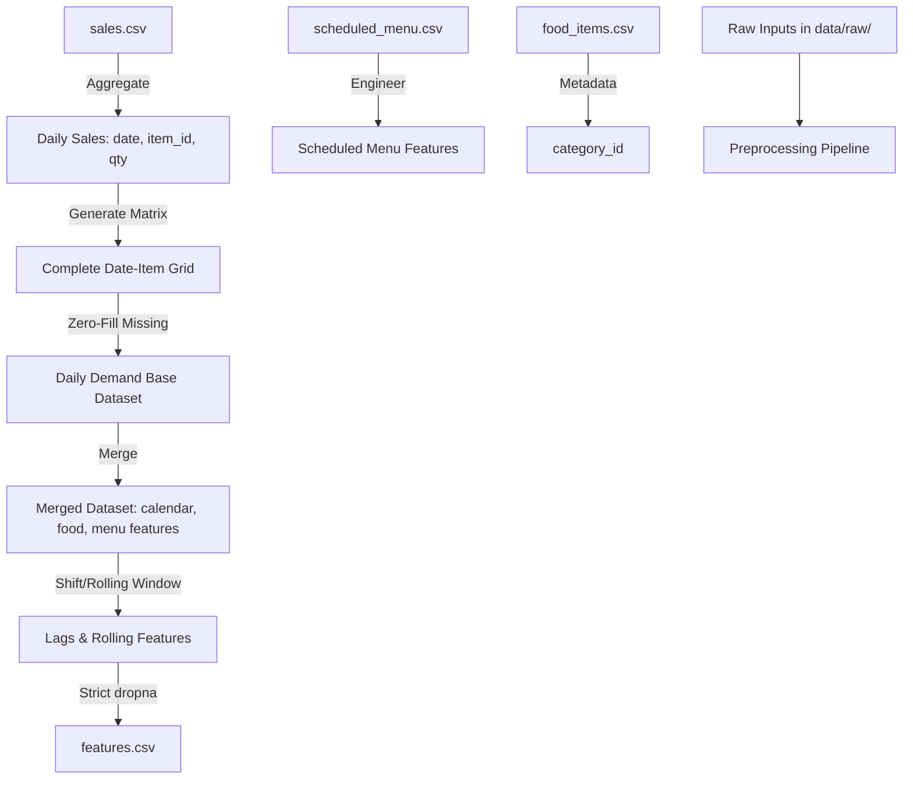

# Implementation Plan - StallBox AI Preprocessing Dataset

This document outlines the final design and implementation plan for the **StallBox Food Demand Forecasting Preprocessing Pipeline** for the university capstone project. 

---

## Recommended Project Architecture

The AI module is built as a modular, lightweight Python service. Since it focuses strictly on data preparation and preprocessing for this phase, the pipeline is designed to be execute-on-demand via a command-line interface.

### Architectural Decisions & Justifications
1. **Single-Stall Forecasting Granularity**: 
   - *Decision*: Forecast demand per food item per day (`date`, `item_id`). Do not include `stall_id`.
   - *Justification*: The application assumes a single-stall canteen context. Removing `stall_id` reduces dimensionality, simplifies feature engineering, and keeps the model appropriate for a capstone project MVP.
2. **Tabular Feature Engineering (Lags and Rolling Averages)**:
   - *Decision*: Build historical features (`lag_1`, `lag_2`, `lag_7`) and rolling statistics (3-day and 7-day mean/std).
   - *Justification*: Canteen demand has strong short-term patterns (sales yesterday) and weekly seasonality (sales on the same day last week). Tree-based models (XGBoost, Random Forest) excel at learning from these features.
3. **Weekly Schedule Mapping (Scheduled Menu Features)**:
   - *Decision*: Extract binary schedule flags (`is_scheduled`), competitor counts (`scheduled_item_count`), and item repeat frequency (`item_scheduled_freq`) from the weekly schedule.
   - *Justification*: The scheduled menu is a major administrative signal. If an item is not scheduled for a given day, it is highly likely to have 0 sales. The count of scheduled items models variety-induced demand dilution.
4. **NaN Handling for Lags (Strict Dropna Policy)**:
   - *Decision*: Do not fill NaNs in lags and rolling statistics with zeros or backward fill. Drop these rows.
   - *Justification*: Filling lag values with 0 or backfilled numbers introduces false historical patterns (data leakage or noise), misleading tree regression splits. Dropping rows with undefined history (e.g. the first 7 days of the timeline) ensures clean training samples.



---

## Folder Structure

The directory layout inside `d:/Yna/Study/TERM_7/SDN302/src/AI/research-by-learning-project-snd302_project_group2`:

```
.
├── data/
│   ├── raw/                      # Raw input CSV data dumps
│   │   ├── sales.csv             # Raw transactional sales history
│   │   ├── scheduled_menu.csv    # Raw weekly scheduled menu definitions
│   │   └── food_items.csv        # Food items metadata
│   └── processed/                # Preprocessed output features
│       └── features.csv          # Final preprocessed feature matrix
├── src/
│   ├── __init__.py
│   ├── config.py                 # Paths, calendar metrics, feature names
│   ├── data_preprocessing.py     # Main preprocessing & feature engineering pipeline class
│   └── utils.py                  # Directory validation and logging helpers
├── tests/
│   └── test_preprocessing.py     # Unit test suite verifying logic
├── main.py                       # CLI script to execute the preprocessing run
├── requirements.txt              # Package list (pandas, numpy, scikit-learn, joblib, pytest)
└── README.md                     # Setup and running instructions
```

---

## Dataset Schema

### 1. Input Datasets

#### Raw Sales Data (`sales.csv`)
| Column | Type | Description | Example |
| :--- | :--- | :--- | :--- |
| `transaction_id` | String | Unique purchase identifier | `TX_00001` |
| `timestamp` | Datetime | Date and time of purchase | `2026-06-20 11:30:00` |
| `item_id` | String | Food item identifier | `food_01` |
| `quantity` | Int | Quantity of items purchased | `3` |
| `unit_price` | Float | Price per item unit | `35000.0` |

#### Scheduled Menu Data (`scheduled_menu.csv`)
| Column | Type | Description | Example |
| :--- | :--- | :--- | :--- |
| `day_of_week` | String | Day of week (`Monday` to `Sunday`) | `Monday` |
| `item_id` | String | Food item identifier | `food_01` |

#### Food Item Data (`food_items.csv`)
| Column | Type | Description | Example |
| :--- | :--- | :--- | :--- |
| `item_id` | String | Unique food item ID | `food_01` |
| `item_name` | String | Food item name | `Phở Bò` |
| `category_id` | String | Food category identifier | `cat_noodle` |
| `category_name` | String | Food category display name | `Noodle` |

---

### 2. Output Dataset Schema (`features.csv`)
| Column | Type | Description | Feature Type |
| :--- | :--- | :--- | :--- |
| `date` | Date | Forecast target date (YYYY-MM-DD) | Index/Key |
| `item_id` | String | Food item ID | Index/Key |
| `quantity_sold` | Int/Float | Daily total quantity sold (Target Variable) | Target |
| `day_of_week` | Int (0-6) | Monday = 0, Sunday = 6 | Calendar |
| `month` | Int (1-12) | Month of year | Calendar |
| `is_weekend` | Binary (0/1) | Weekend flag | Calendar |
| `category_id` | String | Category identifier | Food Metadata |
| `is_scheduled` | Binary (0/1) | Whether item is scheduled on this day of week | Scheduled Menu |
| `scheduled_item_count`| Int | Total number of items scheduled on this day of week | Scheduled Menu |
| `item_scheduled_freq` | Int (0-7) | Number of days in the week this item is scheduled | Scheduled Menu |
| `quantity_lag_1` | Float | Quantity sold 1 day ago | Historical Lag |
| `quantity_lag_2` | Float | Quantity sold 2 days ago | Historical Lag |
| `quantity_lag_7` | Float | Quantity sold 7 days ago | Historical Lag |
| `quantity_roll_mean_3`| Float | Rolling mean quantity sold over last 3 days | Rolling Stat |
| `quantity_roll_mean_7`| Float | Rolling mean quantity sold over last 7 days | Rolling Stat |
| `quantity_roll_std_7` | Float | Rolling standard deviation sold over last 7 days | Rolling Stat |

---

## Data Preprocessing Workflow

1. **Load Raw Files**: Load `sales.csv`, `scheduled_menu.csv`, and `food_items.csv`.
2. **Aggregations**: Summarize sales transactions by `(date, item_id)` to calculate daily `quantity_sold`.
3. **Reindex (Complete Grid)**:
   - Identify all dates within the transactional range.
   - Generate all combinations of dates and active items (`MultiIndex.from_product`).
   - Reindex the sales data to fill missing combinations with `quantity_sold = 0`.
4. **Merge Metadata**:
   - Merge `food_items.csv` columns (`category_id`).
   - Extract `day_of_week` from the date (string name, e.g., `"Monday"`).
   - Merge with the `scheduled_menu.csv` schedule on `(day_of_week, item_id)` to compute `is_scheduled` (1 if exists, else 0).
5. **Scheduled Menu Features**:
   - Compute `scheduled_item_count`: count occurrences of each `day_of_week` in the schedule.
   - Compute `item_scheduled_freq`: count how many days of the week each `item_id` appears in the schedule.
6. **Generate Temporal features**:
   - Calculate numeric `day_of_week` (0-6), `month` (1-12), and `is_weekend` (0/1).
7. **Time-Series Feature Generation**:
   - Group the dataset by `item_id` sorted chronologically by `date`.
   - Calculate shifts for lags `1`, `2`, and `7`.
   - Calculate rolling means (window `3` and `7`) and rolling standard deviation (window `7`).
8. **Boundary Dropna**:
   - Perform `.dropna()` on the engineered dataframe to clean out boundary NaNs where lag history is incomplete.
9. **Export Data**: Save features to `data/processed/features.csv`.

---

## Proposed Changes (Files to Create)

We will initialize the codebase by generating:
1. `requirements.txt`: Python package specifications.
2. `README.md`: Basic description and instructions.
3. `src/config.py`: File paths, features list, default calendar names.
4. `src/utils.py`: Helper functions for logger, path validation.
5. `src/data_preprocessing.py`: Core pipeline code.
6. `main.py`: Runner entrypoint.
7. `data/raw/sample_sales.csv`: Mock sales history.
8. `data/raw/sample_scheduled_menu.csv`: Mock weekly schedule.
9. `data/raw/sample_food_items.csv`: Mock food item catalog.
10. `tests/test_preprocessing.py`: Pytest file validating the pipeline.

---

## Verification Plan

### Automated Tests
Run:
```powershell
pytest tests/
```

### Manual Verification
- Execute `python main.py --mode preprocess` to run the pipeline on the sample mock data.
- Check that the output file `data/processed/features.csv` is successfully generated and matches the schema (specifically: no `NaN` values, features align, no `stall_id` exists).
